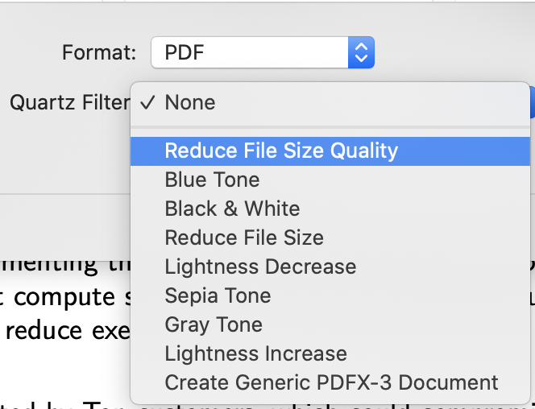

# filter_quality_macos
 Custom filter for macOS

 <p align="center">
  
</p>

The default filter used during exporting a document with "reduced file size" has low-quality presets. This can be an inconvenience when some documents have been reduced in size and quality since the only thing that is sought is the reduction in size.

However, a new filter with new specifications can be created using an existing filter on our computer.

The creation of the filter requires only a few steps on the command line, however, those steps have been concentrated in a single script to do the task in an automated way.

This script has been verified on macOS Catalina (10.15.7). The script should fail on any macOS version that is missing the `Reduce File Size.qfilter` under `/System/Library/Filters`.

## Automated Configuration

Download the `filter_quality_macos.sh` to your local machine and execute it with the security privileges of another user; in this case `root`.

```bash
$ sudo bash ~/filter_quality_macos.sh
Creating directory: /Library/Filters
Copying source: /System/Library/Filters/Reduce File Size.qfilter
Modifying target: /Library/Filters/Reduce File Size Quality.qfilter
$
```

Finally, a new filter will be available in the export window, creating a new document of smaller size and with better quality than that offered by the filter by default.